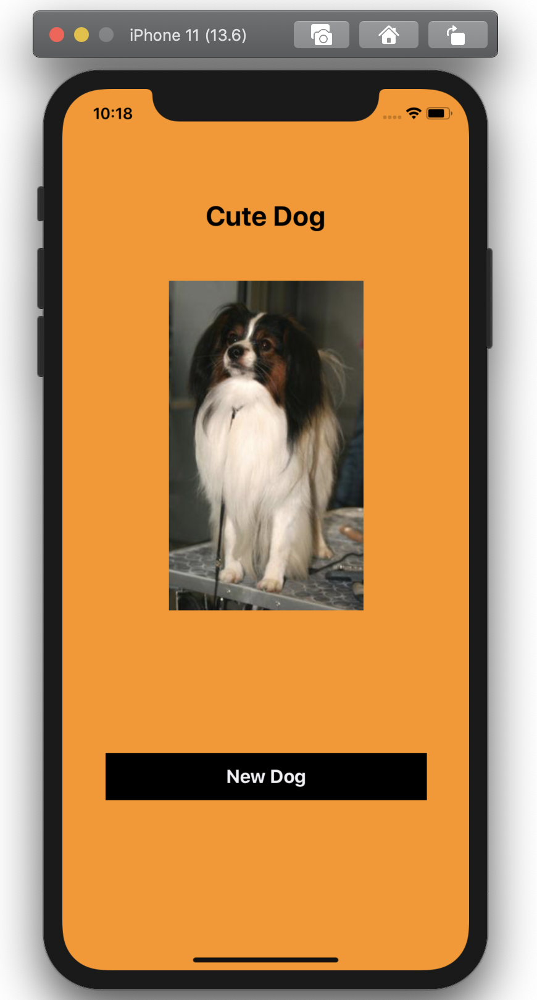
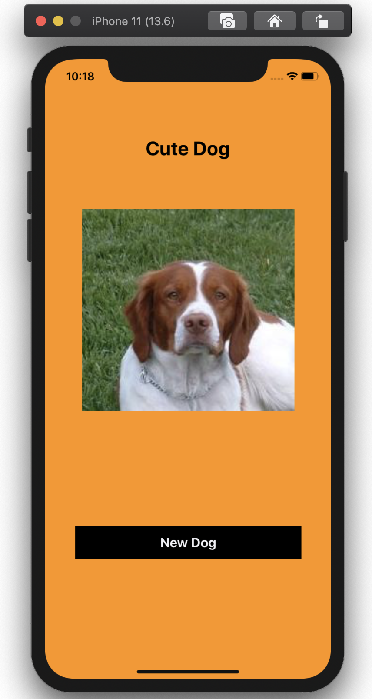
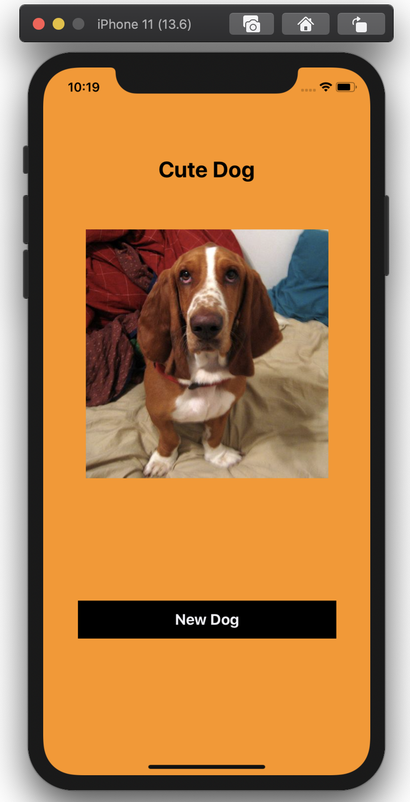
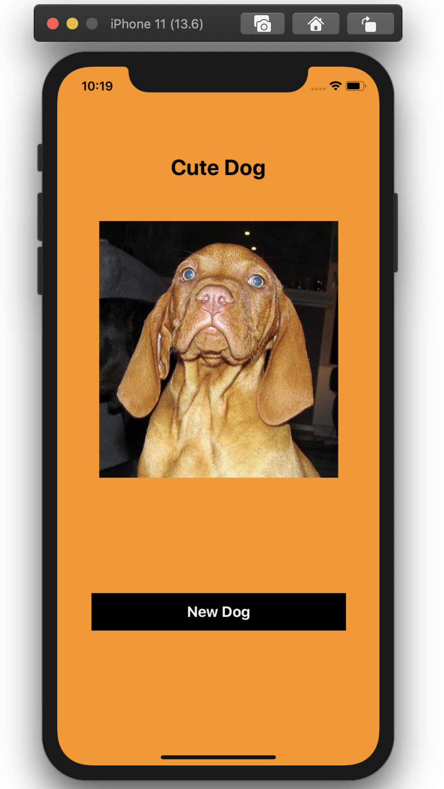

# cuteDogs

Um pequeno app para aprender alguns frameworks. 

## Descrição

Criei um app iOS usando a [**Dog API**](https://dog.ceo/dog-api/documentation/random)

Consiste em uma tela com um botão que troca a imagem para ir mostrando cachorrinhos fofos. 

### Arquitetura

Primeiro projeto que uso a arquitetura VIPER.

Para mais informações sobre a arquitetura VIPER visite [**Começando com VIPER**](http://equinocios.com/viper/2017/03/14/comecando-com-viper/)

    

### Frameworks

* Comecei a estudar CI/CD e nesse app integrei Fastlane e Bitraise, rodando os testes pelo Fastlane.
* Aprendi automação de requisições utilizando Moya.
* Utilizei Kingfisher para requisição das imagens.

### Requirements

* Swift 5.0
* Xcode 10.0+
* iOS 13.6+

### Libraries

* [**Moya**](https://github.com/Moya/Moya)
* [**Kingfisher**](https://github.com/onevcat/Kingfisher)

### Screenshots

<table style="width:100%">
  <tr>
    <td></td>
    <td></td>
    <td></td>
    <td></td>
  </tr>
</table>

### Author

|  | [@laridtm](https://github.com/laridtm/) |
| ------ | ------ |

